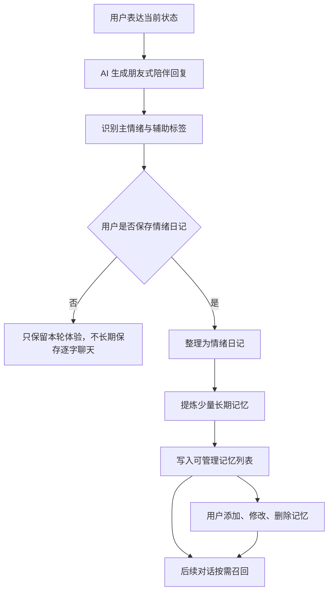
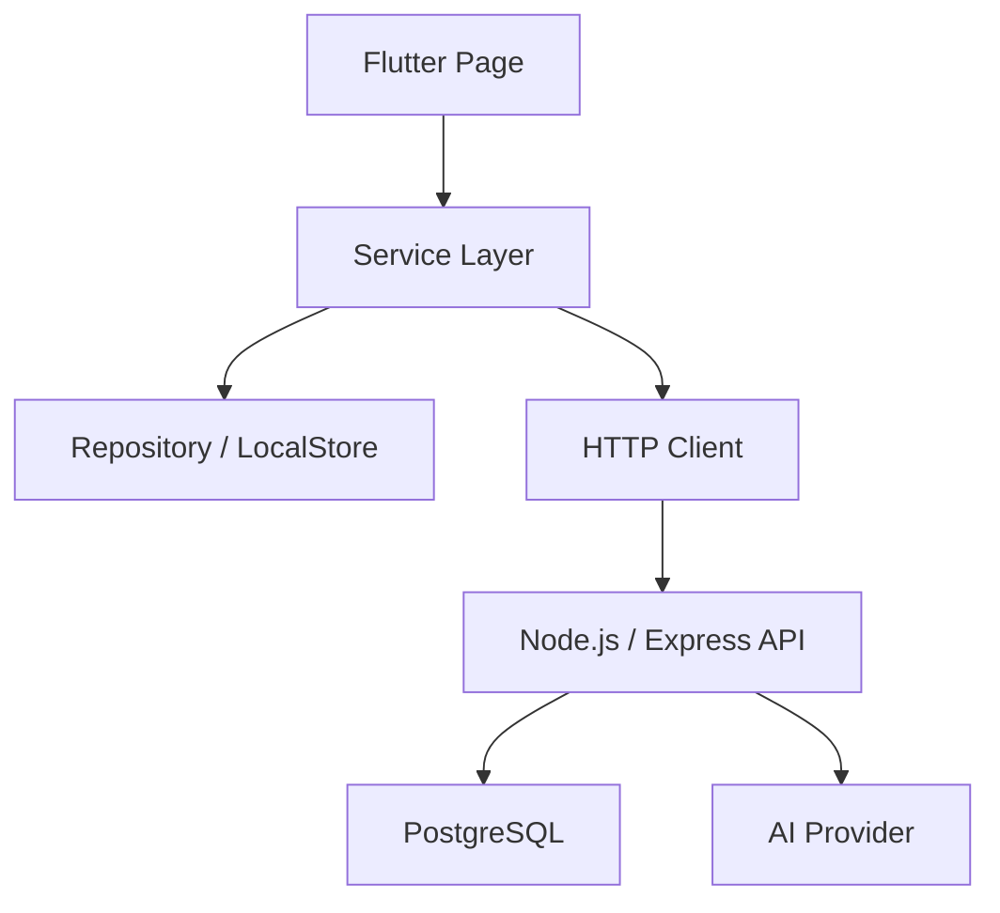

# Easylife｜AI 情绪陪伴与轻量记录 App MVP

> Vibe Coding 实践项目｜Flutter iOS MVP｜AI 陪伴产品机制｜本地优先架构

## 项目概览

Easylife 是一个 AI 情绪陪伴与轻量记录 App MVP，目标不是做一个泛娱乐聊天角色，而是验证
“AI 是否能持续理解用户的思维方式、情绪敏感点和近期关注，并在后续互动中让用户感到被理解”。

项目围绕一条核心闭环展开：

```text
用户表达
  -> AI 理解与陪伴回复
  -> 情绪识别
  -> 用户确认保存
  -> 生成情绪日记
  -> 提炼长期记忆
  -> 后续对话按需召回
  -> 用户纠错、删除或更新记忆
```

我独立完成了从产品定位、交互原型、数据模型、Prompt 流程、前后端接口到 Flutter iOS
MVP 的主要设计与实现，并将项目整理成可公开访问的 Web Demo，方便面试官直接体验主流程。

> Demo 链接：`TODO: 填写公开 Web Demo 链接`
>
> 代码仓库：`TODO: 填写 GitHub / 作品集仓库链接`
>
> 演示视频：`TODO: 填写视频链接`

## 我的角色

- 竞品分析：分析 Replika、Character.AI、星野等 AI 陪伴产品的长期陪伴、角色互动和中文陪伴体验。
- 产品收敛：将 MVP 定位从“泛 AI 生活助手”收敛到“情绪陪伴 + 轻量记录 + 长期记忆”。
- 交互设计：设计表达、陪伴回复、保存日记、提炼记忆、后续召回和记忆管理流程。
- AI 流程设计：拆解陪伴回复、情绪识别、日记整理、长期记忆提炼和后续召回策略。
- Flutter 实现：完成 iOS 优先的 Flutter MVP，包括首页、陪伴、饮食、我的、设置和 Demo 入口。
- 工程架构：设计 Service / Repository 分层、本地优先存储、OpenAPI 契约和后端认证骨架。
- 测试与交付：覆盖核心 Widget 流程、认证状态机、Demo 数据播种、持久化和 Web release 构建。

## 背景与洞察

AI 陪伴产品的关键不只是“回复像人”，而是能否在多次互动后形成连续感。用户真正感到被理解，
往往来自 AI 能记住这些信息：

- 我最近在关注什么
- 我容易在哪些情境下焦虑或疲惫
- 我希望被怎样安慰或提醒
- 我过去提过哪些目标、偏好和生活习惯
- 我是否能纠正 AI 对我的误解

竞品给我的启发：

| 产品 | 观察 | 对 Easylife 的启发 |
| --- | --- | --- |
| Replika | 强调长期陪伴和关系感 | 长期记忆是陪伴感的核心，不应只是单轮聊天 |
| Character.AI | 角色互动强、娱乐性高 | 角色感有吸引力，但 MVP 不应陷入角色广场和内容消费 |
| 星野 | 中文陪伴、角色关系和即时反馈体验较成熟 | 中文语境中的陪伴需要更温和、低压、少说教 |

因此我没有把 Easylife 做成“更多角色、更多玩法”的产品，而是把 MVP 收敛到一个更小的问题：

> 用户是否愿意向 AI 表达真实状态，并允许 AI 在用户确认后沉淀记忆，从而在后续互动里更懂自己？

## MVP 范围

### 当前做什么

- 用户画像：昵称、生日、性别、职业、MBTI、目标、饮食偏好和陪伴偏好。
- AI 陪伴：文字输入、语音转写入口、朋友式陪伴回复和轻量多轮对话。
- 情绪日记：用户确认后，把本轮表达整理成温和、结构化的情绪记录。
- 长期记忆：从已保存日记中提炼少量可复用记忆，并支持用户管理。
- 饮食体重：用一句话记录食物、估算热量、保存贴纸和查看日 / 周 / 月饮食回顾。
- Web Demo：无需手机号进入带预置数据的作品演示模式。

### 当前不做什么

- 不做角色广场和泛娱乐聊天社区。
- 不做灵感创作、塔罗等与 MVP 闭环无关的扩展板块。
- 不把 Mock 回复包装成真实 AI 能力。
- 不在 Flutter 客户端保存模型 API Key。
- 不把情绪或健康内容描述为医疗、心理或营养诊断。

## 核心闭环

Easylife 的核心不是单次“聊完就结束”，而是让表达变成可被用户控制的长期上下文。



这个闭环对应产品的关键假设：

- 用户愿意表达，前提是 AI 回复不能太报告化或太强干预。
- 用户愿意保存，前提是保存动作由用户确认，而不是系统默认永久记住。
- 用户感到被理解，前提是后续回复能召回相关记忆，但又不会暴露过度跟踪感。
- 用户愿意长期使用，前提是可以纠错、删除和更新 AI 对自己的理解。

## 长期记忆机制

长期记忆是这个项目最核心的产品机制。我把它拆成四层：

```text
1. 当轮对话层
   用于即时陪伴，不长期保存完整逐字聊天。

2. 用户确认层
   只有用户主动保存情绪日记后，才进入结构化沉淀。

3. 可管理记忆层
   提炼少量长期记忆，用户可以查看、添加、修改、删除。

4. 按需召回层
   后续 AI 回复只使用有限、相关、低敏的记忆上下文。
```

### 记忆分类

当前适合沉淀的记忆类型：

- 情绪敏感点：例如“连续加班后容易感到疲惫和自责”。
- 恢复方式：例如“散步和听轻音乐能帮助自己慢慢放松”。
- 近期关注：例如“最近在准备作品集和面试”。
- 沟通偏好：例如“压力大时希望先被倾听，而不是立刻给建议”。
- 生活习惯：例如“早餐偏简单，下午容易想喝咖啡”。

### 保存与召回原则

- 最小化：只保存后续陪伴确实有帮助的信息。
- 用户确认：对话不会自动永久记住。
- 可纠错：用户能直接修改 AI 对自己的理解。
- 可删除：用户可以删除不想保留的记忆。
- 有限召回：后续分析只取有限条相关记忆，避免过度个性化和上下文膨胀。

当前本地实现中，长期记忆保存在 `UserProfile.memoryNotes`，最多保留最近 12 条。后续接入真实
AI provider 时，记忆筛选和召回策略应继续在后端或规则层控制，而不是把完整聊天历史直接交给模型。

## 关键界面

> 下面截图需要替换为你的实际素材。建议使用 390px 手机宽度截图，再补一张桌面响应式截图。

### 1. 作品集 Demo 入口

`TODO: 插入截图 - 打开 Web Demo 后显示“进入作品演示”按钮`

说明文案：

> 面试官无需手机号和验证码，点击“进入作品演示”即可进入预置用户数据。Demo 数据仅保存在当前浏览器。

### 2. 首页

`TODO: 插入截图 - 首页伙伴状态、每日运势、今日记录状态`

说明文案：

> 首页负责建立低压陪伴氛围，展示伙伴状态、每日运势和今日记录概览，而不是把用户推入复杂的数据面板。

### 3. 陪伴对话

`TODO: 插入 GIF - 输入一段情绪内容，收到伙伴回复`

说明文案：

> 陪伴回复采用朋友式语气，不在单轮对话里强行展示分析报告。用户可以先表达，再决定是否保存。

### 4. 情绪日记

`TODO: 插入截图 - 保存情绪日记后的详情页`

说明文案：

> 用户确认保存后，系统将本轮表达整理成温和的情绪日记，避免使用“分析报告”式标题造成压力。

### 5. 长期记忆管理

`TODO: 插入截图或 GIF - 长期记忆列表、添加、修改、删除`

说明文案：

> 长期记忆不是黑盒。用户可以查看 AI 记住了什么，也可以主动纠错和删除。

### 6. 饮食与轻量记录

`TODO: 插入 GIF - 一句话记录食物 -> 热量确认 -> 保存贴纸`

说明文案：

> 饮食模块用于补充生活记录闭环，重点是轻量记录、复盘和可执行建议，而不是复杂健康管理。

## 工程架构

Easylife 的 Flutter 客户端采用页面、服务和数据层分离：



关键边界：

- `lib/pages/`：页面展示、输入和流程编排。
- `lib/services/agent_service.dart`：AI 能力统一入口，隔离 Mock 与 HTTP 实现。
- `lib/services/journal_repository.dart`：情绪、饮食、体重等日志型数据访问。
- `lib/services/local_store.dart`：本地键值存储抽象、用户级前缀隔离和测试替身。
- `contracts/openapi.yaml`：前后端接口契约的唯一事实来源。
- `backend/server/`：Node.js / Express API、认证路径和 provider 边界。
- `backend/database/migrations/`：PostgreSQL 版本化迁移。

页面不直接保存模型 API Key，不直接调用模型接口，也不直接绑定具体存储方案。这样做的好处是：

- 本地 Mock 可以稳定支持 Demo 和测试。
- 后续真实 AI provider 可以在后端替换，不影响 Flutter 页面。
- 本地优先和云同步可以分阶段推进。
- 认证、同步和账号删除可以通过 OpenAPI 契约逐步联调。

## AI 与 Prompt 流程

项目中的 AI 设计不是“让模型生成所有东西”，而是把模型限制在真正需要语义判断和自然语言表达的地方。

### 陪伴回复

目标：

- 温和、低压、朋友式陪伴。
- 承认用户感受，但不制造诊断。
- 可以提出一个轻量问题或下一步，但不强迫用户立刻解决。

不做：

- 不输出机械报告。
- 不把单轮对话强行拆成过多结构化模块。
- 不声称可以替代专业心理支持。

### 情绪识别

输出重点：

- 主情绪标签
- 辅助情绪标签
- 陪伴回复
- 可选建议
- 风险等级或服务建议的预留位置

### 情绪日记整理

触发条件：

- 用户主动点击“保存情绪日记”。

整理内容：

- 本轮发生了什么
- 用户可能在意什么
- 情绪如何变化
- 可以尝试的小行动
- 一句温和收尾

### 长期记忆提炼

只提炼后续有用的信息，例如：

- 稳定偏好
- 情绪敏感点
- 恢复方式
- 近期重复出现的关注

不长期保存：

- 完整逐字聊天记录
- 过度隐私的原文
- 一次性、不可复用的细节
- 可以由代码计算的 UI 字段

## 数据模型与接口

代表性数据结构：

- `UserProfile`：用户画像、偏好、系统权限和 `memoryNotes`。
- `PetMoodLog`：情绪日记、情绪标签、伙伴回复、整理后的温和记录。
- `MealRecord` / `WeightRecord`：轻量饮食和体重记录。
- `AgentService`：统一 AI 能力边界。
- `/v1/emotion/analyze`：情绪分析 HTTP 接口，失败时客户端回退本地 Mock。

数据流示例：

```text
CompanionPage
  -> AgentService.analyzeEmotion()
  -> MockAgentService / HttpAgentService
  -> 用户确认保存
  -> JournalRepository.saveMoodLogs()
  -> UserProfile.memoryNotes 更新
```

## Web Demo

公开 Demo 的目标是让面试官稳定进入主流程，不依赖真实账号或后端。

体验方式：

1. 打开 Demo 链接。
2. 点击“进入作品演示”。
3. 首页查看预置伙伴、每日运势和今日状态。
4. 进入“陪伴”发送一段情绪文本。
5. 保存情绪日记，查看详情。
6. 进入“长期记忆”查看可管理记忆。
7. 进入“饮食”查看记录和回顾。

Demo 边界：

- 数据只保存在当前浏览器本地。
- Mock AI 用于稳定演示，不代表真实模型已上线。
- 不连接真实短信、真实数据库或真实生产后端。
- 清除浏览器站点数据后可重置 Demo。

## 测试与验证

当前项目已覆盖：

- 新用户登录、基础信息、主 App 进入流程。
- 手机、平板、桌面三档主页面响应式布局。
- 陪伴对话、保存情绪日记、长期记忆增删改。
- 饮食记录、热量估算、贴纸保存、防重复点击和异步退出。
- 认证错误码、Token 刷新、退出、会话恢复和本地数据隔离。
- 作品集 Demo 数据播种、刷新、退出后重新进入的持久化行为。

最近一次验证：

| 命令 | 结果 |
| --- | --- |
| `dart format --output=none --set-exit-if-changed lib test` | 通过 |
| `flutter analyze` | 通过 |
| `flutter test` | 65 个测试通过 |
| `flutter build web --release` | 通过 |
| `flutter build web --release --dart-define=EASYLIFE_DEMO_MODE=true` | 通过 |

> TODO: 如果后续重新跑过测试，请把日期和结果更新为最新。

## 上线后评估方案

这个项目的验证指标不只看 DAU 或聊天次数，而是围绕“是否被理解”设计：

| 指标 | 含义 | 目的 |
| --- | --- | --- |
| 记忆保存率 | 有多少对话最终被用户保存为日记或记忆 | 判断用户是否愿意让 AI 记住自己 |
| 日记生成率 | 用户表达后转化为情绪日记的比例 | 判断记录闭环是否自然 |
| 有效召回率 | 后续回复中召回的记忆是否被用户认为相关 | 判断长期记忆质量 |
| 被理解感评分 | 用户主观反馈“它是否懂我” | 评估陪伴体验核心价值 |
| 记忆纠错率 | 用户修改或删除记忆的比例 | 发现 AI 提炼不准或过度记忆的问题 |
| 次日 / 7 日回访 | 用户是否愿意持续回来表达 | 判断长期陪伴潜力 |

可能的评估方式：

- 日记保存后询问“这条整理是否贴近你想表达的意思？”
- 记忆召回后询问“这个提醒是否有帮助？”
- 长期记忆页面统计用户修改、删除和新增行为。
- 访谈用户是否感到 AI 更懂自己的表达方式和情绪敏感点。

## 复盘

### 我学到的

- AI 陪伴的核心不是多生成内容，而是建立连续、可控、不过界的理解。
- 长期记忆必须有用户确认和纠错入口，否则容易带来不安全感。
- MVP 不应该追求功能多，而应该先验证最关键的情感和行为闭环。
- Mock 不等于偷懒。稳定 Mock 可以支撑 Demo、测试和契约先行，避免过早接入不可控外部依赖。

### 如果继续迭代

- 接入真实 AI provider，并增加输出 schema 校验、风险分级和成本监控。
- 将长期记忆从本地列表升级为带分类、权重、更新时间和过期策略的结构化记忆。
- 完成云端同步、离线 outbox、冲突解决和账号删除全链路。
- 用真实用户反馈验证记忆保存率、有效召回率和被理解感。
- 补齐 iOS TestFlight、签名、隐私说明和生产监控。

## 可直接放入作品集首页的简介

Easylife 是一个 AI 情绪陪伴与轻量记录 App MVP。我通过分析 Replika、Character.AI、
星野等 AI 陪伴产品，将项目收敛为“让 AI 持续理解用户思维方式、情绪敏感点和近期关注”的
MVP，并独立完成从交互原型、数据模型、Prompt 流程、前后端接口到 Flutter iOS MVP 的设计与实现。

项目跑通了“表达 -> 理解 -> 用户确认记忆 -> 后续召回 -> 长期陪伴”的核心闭环，并围绕长期记忆
设计了分类、用户确认、按需召回、纠错删除和过期机制。工程上采用 Flutter、Service /
Repository 分层、本地优先持久化、OpenAPI 契约和 Node.js / PostgreSQL 后端骨架，支持公开
Web Demo 稳定体验主流程。

## 待你补充

- `TODO: Demo 链接`
- `TODO: GitHub / 代码仓库链接`
- `TODO: 演示视频链接`
- `TODO: 首页截图`
- `TODO: 陪伴对话 GIF`
- `TODO: 情绪日记截图`
- `TODO: 长期记忆管理截图或 GIF`
- `TODO: 饮食记录 GIF`
- `TODO: 如果有真实用户反馈或访谈记录，补充 1-2 条`
- `TODO: 如果有部署平台截图，补充 Netlify / Cloudflare / Vercel 发布截图`
